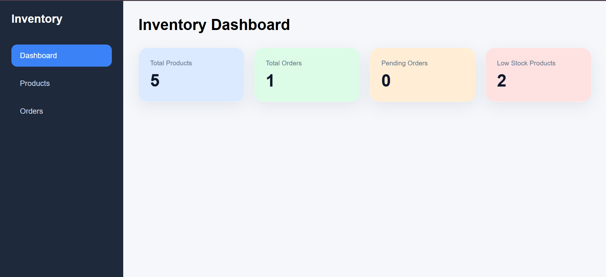
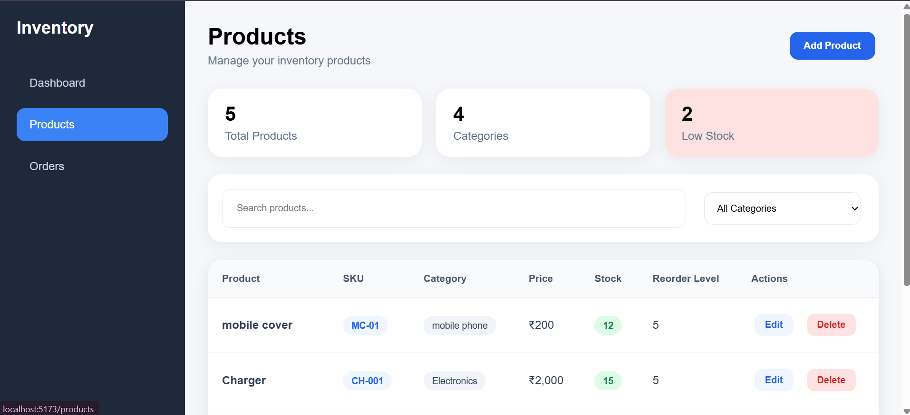

# Inventory & Order Management System

A simple MERN stack application for managing products, stock, and customer orders.

## Features

- Product management with add, edit, delete, search, and category filter
- Order management with create order and update status
- Dashboard summary cards for products, orders, pending orders, and low stock items

## Tech Stack

- React.js
- Vite
- Node.js
- Express.js
- MongoDB
- Mongoose
- Axios
- React Toastify

## Project Structure

- frontend/ - React frontend
- backend/ - Express backend

## Setup Instructions

### 1. Clone the project

```bash
git clone <your-repo-url>
cd Mini-Inventory
```

### 2. Backend setup

```bash
cd backend
npm install
```

Create a `.env` file inside the `backend` folder with:

```env
PORT=3001
MONGO_URI=mongodb://127.0.0.1:27017/inventory-db
```

Start the backend:

```bash
npm run dev
```

### 3. Frontend setup

```bash
cd ../frontend
npm install
```

Create a `.env` file inside the `frontend` folder with:

```env
VITE_API_URL=http://localhost:3001/api
```

Start the frontend:

```bash
npm run dev
```

## Default URLs

- Frontend: http://localhost:5173
- Backend API: http://localhost:3001/api

## Screenshots / Demo Video

### Dashboard



### Products Page



## Demo Video

[▶️ Watch Demo Video](./screenshots/Demo.gif)
